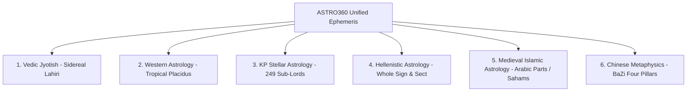

# Multi-Tradition Astrological Synthesis Standards

## 1. The 6 Core Astrological Traditions

ASTRO360 unifies 6 world traditions without diluting their unique classical epistemologies:

---

## 2. Tradition Calibration Standards

### A. Vedic Jyotish (Parashari & Jaimini)
- **Ayanamsha**: True Lahiri (Chitra Paksha, $180^\circ$ to Spica).
- **Vargas**: Complete Shodashavarga (D1 to D60).
- **Dashas**: 120-Year Vimshottari ($365.2422$ solar days per year).
- **Strengths**: 6-Fold Shadbala & 337-Bindu Sarvashtakavarga.

### B. Western Tropical Astrology
- **Coordinate System**: Ecliptic Tropical ($0^\circ$ Aries at Vernal Equinox).
- **House Systems**: Placidus (primary quadrant) and Whole Sign (classical).
- **Aspect Orbs**: Conjunction ($8^\circ$), Opposition ($8^\circ$), Trine ($7^\circ$), Square ($6^\circ$), Sextile ($5^\circ$), Quincunx ($2^\circ$).

### C. KP Stellar Astrology (Krishnamurti Paddhati)
- **KP Ayanamsha**: $23^\circ 45' 56''$ baseline.
- **249 Sub-Lord Division**: 27 Nakshatras broken into 9 unequal sub-arcs according to Vimshottari period ratios.
- **Cuspal Ruling Planets**: Sign Lord $\to$ Star Lord $\to$ Sub Lord.

### D. Hellenistic Astrology
- **House System**: Whole Sign Houses (*Dodekatropos*).
- **Planetary Sect**: Diurnal (*Sun, Jupiter, Saturn*) vs Nocturnal (*Moon, Venus, Mars*).
- **Time Lord Systems**: Decennials and Zodiacal Releasing from the Lot of Fortune.

### E. Medieval Islamic Astrology
- **Arabic Parts (Sahams)**:
  - *Part of Fortune ($Pars\ Fortunae$)*: $Asc + Moon - Sun$ (Day), $Asc + Sun - Moon$ (Night).
  - *Part of Spirit ($Pars\ Daemonis$)*: $Asc + Sun - Moon$ (Day), $Asc + Moon - Sun$ (Night).
  - *Part of Marriage & Love*: $Asc + Venus - Saturn$.
- **Authorities**: Al-Biruni (*Kitab al-Tafhim*), Abu Ma'shar (*The Great Introduction*), Al-Kindi.

### F. Chinese Metaphysics (BaZi Four Pillars)
- **Four Pillars of Destiny**: Year, Month, Day, and Hour Pillars.
- **10 Heavenly Stems** ($Jia, Yi, Bing, Ding, Wu, Ji, Geng, Xin, Ren, Gui$).
- **12 Earthly Branches** with Five Element (*Wu Xing*) balance (Wood, Fire, Earth, Metal, Water).
