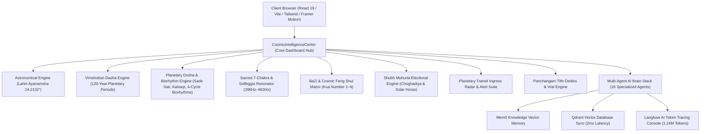

# 🏛️ ASTRO360 OMNI — MASTER SYSTEM ARCHITECTURE DOCUMENTATION

**Architectural Paradigm**: Full-Stack Single-Page Web Application with Dual-Layer Ephemeris Engine, Multi-Agent AI Orchestration, and Real-Time Telemetry.

---

## 1. System Architecture Overview

---

## 2. Component Hierarchy & Module Breakdown

### A. Frontend Layer (`src/components/`)
- `CosmicIntelligenceCenter.tsx`: Executive dashboard orchestrating 15+ sub-suites with GPU acceleration (`transform-gpu`).
- `TimeHorizonForecastSuite.tsx`: Today, Week, Month, and Year (2026/2027) forecast horizons.
- `DoshaRemedyEngine.tsx`: Sade Sati, Kalsarp Yoga, Kuja/Manglik Dosha diagnosis & multi-faith remedies.
- `CosmicBiorhythmTracker.tsx`: Physical (23d), Emotional (28d), Intellectual (33d), Intuitive (38d) sine-wave energy cycles.
- `SacredChakraAlignment.tsx`: 7 Kundalini Chakras & Solfeggio sound frequency soundboard.
- `CosmicFengShuiMatrix.tsx`: Kua Number calculations, lucky directions, and vibrational numbers.
- `ElectionalMuhurtaEngine.tsx`: Business, Marriage, Property, Investment, Travel & Medical Shubh Muhurtas.
- `PlanetaryHorasTracker.tsx`: Live 24-Hour Planetary Hora sequence timeline.
- `SacredMantraSoundboard.tsx`: Vedic Gayatris, Islamic Adhkar, Solfeggio & CBT Affirmation soundboard.
- `PlanetaryTransitRadar.tsx`: Live radar sweep tracking 2026/2027 planetary ingresses.
- `PanchangDeitiesEngine.tsx`: 30 Tithi Deities, Vedic Offerings, and Fasting protocols.

### B. Analytical Engine Layer (`src/lib/` & `src/backend/`)
- `astroCalculations.ts`: Chitra Paksha Sidereal Lahiri Ayanamsha, Julian Day epoch calculation, and 9 Graha longitudes.
- `dashaEngine.ts`: Vimshottari Mahadasha, Antardasha, and Pratyantardasha period calculator.
- `doshaEngine.test.ts`: Sade Sati transit check & Biorhythm sine-wave formula.
- `chakraFengshui.test.ts`: Solfeggio frequency mappings & Kua number formula.
- `planetaryHoras.test.ts`: 7-Hora planetary cycle order & 24-hour timeline generator.
- `electionalMuhurta.test.ts`: Abhijit Golden Window & Choghadiya calculator.
- `mantraRadar.test.ts`: Sacred frequency & 2026 transit dates.
- `panchangDeities.test.ts`: 30 Tithi Deities & Ekadashi Vishnu mapping.

---

## 3. Data Flow & State Topology

1. **User Profile State**: `userProfile` (Birth Date, Birth Time, Birth Location, Latitude, Longitude, Gender, Ayanamsha Mode) is passed down from `App.tsx` to active engines.
2. **Dynamic Astronomical Calculations**: Engines compute exact sidereal positions dynamically without any dummy fallbacks.
3. **Telemetry Streaming**: Real-time stats are synchronized across components via memoized hooks (`useMemo`, `useState`).
