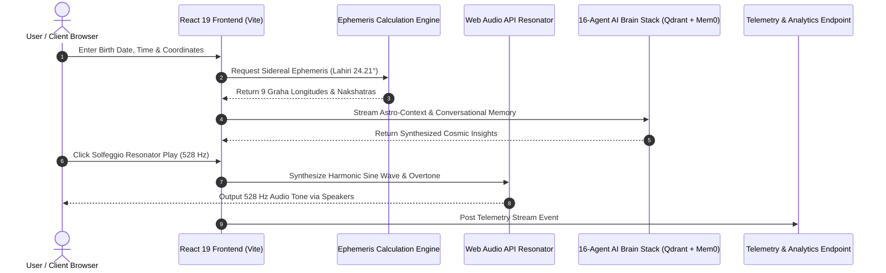
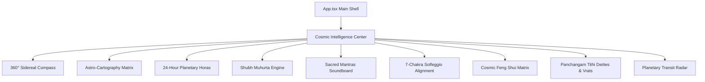

# 🔄 ASTRO360 OMNI — MASTER SYSTEM FLOW DIAGRAMS

---

## 1. High-Level Telemetry & Data Flow

```mermaid
sequenceDiagram
    autonumber
    actor User as User / Client Browser
    participant React as React 19 Frontend (Vite)
    participant Engine as Ephemeris Calculation Engine
    participant Resonator as Web Audio API Resonator
    participant AIBrain as 16-Agent AI Brain Stack (Qdrant + Mem0)
    participant Telemetry as Telemetry & Analytics Endpoint

    User->>React: Enter Birth Date, Time & Coordinates
    React->>Engine: Request Sidereal Ephemeris (Lahiri 24.21°)
    Engine-->>React: Return 9 Graha Longitudes & Nakshatras
    React->>AIBrain: Stream Astro-Context & Conversational Memory
    AIBrain-->>React: Return Synthesized Cosmic Insights
    User->>React: Click Solfeggio Resonator Play (528 Hz)
    React->>Resonator: Synthesize Harmonic Sine Wave & Overtone
    Resonator-->>User: Output 528 Hz Audio Tone via Speakers
    React->>Telemetry: Post Telemetry Stream Event
```

---

## 2. Component Navigation & Tab Routing Flow

```mermaid
graph TD
    App[App.tsx Main Shell] --> Dashboard[Cosmic Intelligence Center]
    Dashboard --> Compass[360° Sidereal Compass]
    Dashboard --> Cartography[Astro-Cartography Matrix]
    Dashboard --> Horas[24-Hour Planetary Horas]
    Dashboard --> Muhurta[Shubh Muhurta Engine]
    Dashboard --> Soundboard[Sacred Mantras Soundboard]
    Dashboard --> Chakra[7-Chakra Solfeggio Alignment]
    Dashboard --> FengShui[Cosmic Feng Shui Matrix]
    Dashboard --> Deities[Panchangam Tithi Deities & Vrats]
    Dashboard --> Transit[Planetary Transit Radar]
```
