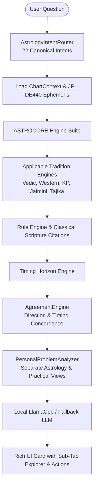

# ASTRO360 Ask Architecture & Personal AI Pipeline

## 1. Overview & Core Philosophy
The ASTRO360 Ask experience is not a generic conversational wrapper. It is a deterministic, high-precision **Personal Astrology Analysis & Problem-Solving Engine**.

## 2. Invariant Pipeline Flow
1. **QUESTION**: User enters inquiry in natural language.
2. **INTENT**: Classified into one of 22 intents (`NATAL_FACT`, `CAREER`, `TIMING`, `DECISION_SUPPORT`, etc.).
3. **PERSONAL CONTEXT**: Validates active user birth parameters (`DOB`, `Time`, `Lat`, `Lon`, `Timezone`).
4. **DATA REQUIREMENTS**: Asserts required data (e.g. `BIRTH_DATA`, `CHART_AND_TIMING`, `TRANSIT_DATE`).
5. **CHART LOAD**: Retrieves validated chart coordinates from ASTROCORE.
6. **ASTROCORE**: Calculates high-precision ephemeris (NASA JPL DE440 sub-arcsecond accuracy).
7. **APPLICABLE ENGINES**: Executes only eligible traditions (e.g. Vedic Parashari, Western Tropical, KP Stellar, Jaimini Sutras).
8. **RULE EVALUATION**: Evaluates classical scripture rules (*BPHS, Phaladeepika, Tetrabiblos, KP Readers*).
9. **TIMING**: Resolves temporal activity windows (Start, Peak, End).
10. **CROSS-ENGINE COMPARISON**: Compares findings side-by-side.
11. **AGREEMENT**: Calculates Direction Agreement % ($Agreeing / Eligible 	imes 100$) and Lineage-Adjusted concordances.
12. **EVIDENCE**: Attaches tier-1 scripture citations and calculation telemetry.
13. **UNCERTAINTY**: Computes birth-time sensitivity across $\pm 5	ext{m}, \pm 10	ext{m}, \pm 15	ext{m}, \pm 30	ext{m}$ drift.
14. **SEPARATION**: Strictly separates **ASTROLOGY VIEW** from **PRACTICAL VIEW**.
15. **USER AGENCY**: Empowers the seeker with actionable next steps (*User Decides*).
