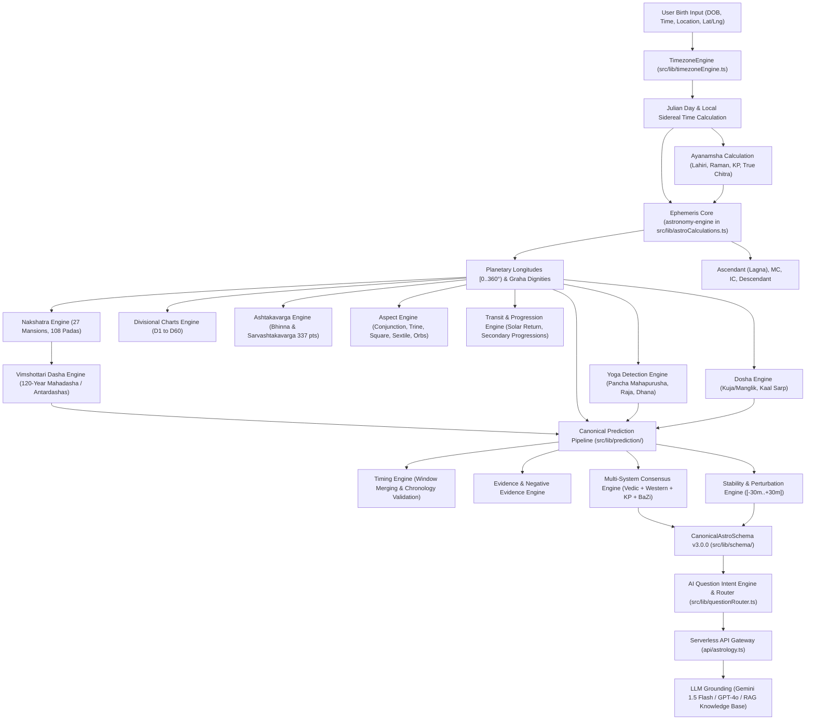

# ASTRO360 Computational Astronomy & Calculation Engine Audit Report

## 1. Executive Summary & Repository Layout

The **ASTRO360** repository contains a hybrid computational architecture supporting multi-tradition astrological calculations: Vedic (Parashari, Jaimini, KP, Tajika), Western (Tropical, Solar Arc, Secondary Progressions, Hellenistic), Chinese (BaZi Four Pillars, 10 Gods, Zi Wei Dou Shu), and Islamic Astronomical systems (Prayer Times, Qibla Spherical Geometry, Kuwaiti Tabular Hijri conversion).

The codebase exhibits two layers of calculation architecture:
1. **The Active Production Pipeline (`astronomy-engine` & Pure Mathematical Engines)**:
   - Primary Ephemeris: [`astronomy-engine`](https://github.com/cosinekitty/astronomy) (v2.1.19) via `src/lib/astroCalculations.ts`. Computes true Keplerian/VSOP geocentric ecliptic longitudes for Sun, Moon, Mars, Mercury, Jupiter, Venus, and Saturn, with analytical approximations for lunar nodes (Rahu/Ketu) and Ascendant.
   - Master Deterministic Orchestrator: `src/lib/astroCoreOrchestrator.ts` producing `CanonicalAstroSchema` (v3.0.0).
   - Authoritative Canonical Prediction Engine: `src/lib/prediction/` featuring `canonicalPipeline.ts`, `timingEngine.ts`, `consensusEngine.ts`, `stabilityEngine.ts`, `evidenceEngine.ts`, `ruleRegistry.ts`, `rectificationEngine.ts`, and `journalAndBacktesting.ts`.
   - Dedicated Vedic Engines: `src/lib/vedic/` (`ashtakavargaEngine.ts`, `dashaEngine.ts`, `divisionalChartsEngine.ts`, `doshaEngine.ts`, `jaiminiEngine.ts`, `nakshatraEngine.ts`, `yogaEngine.ts`, `muhurtaEngine.ts`, `varshaphalEngine.ts`).
   - Dedicated Western Engines: `src/lib/western/` (`westernEngine.ts`, `aspectEngine.ts`, `synastryEngine.ts`, `transitEngine.ts`).
   - Multi-Agent Orchestrator: `src/backend/agentOrchestrator.ts` and `src/backend/specializedAgents.ts`.

2. **Placeholder/Stubbed Prototype Engines**:
   - `src/lib/ephemeris/planetaryPositions.ts` (contains stubbed `calculateKeplerianElements` and `calculateVSOP87` returning zeroes).
   - `src/lib/ephemeris/houseCalculation.ts` (returns equal 30° cusps regardless of system).
   - `src/lib/ephemeris/fixedStars.ts` & `eclipseEngine.ts` (placeholder offsets).
   - `src/lib/vedic/kundliMatchingEngine.ts` (hardcoded mock return `32.5`; overridden by `src/lib/vedic/nakshatraEngine.ts` and `src/lib/astroCalculations.ts`).
   - `src/lib/vedic/panchangEngine.ts` (hardcoded placeholder; real calculation in `src/lib/astroCalculations.ts`).
   - `src/lib/vedic/shadBalaEngine.ts` (fixed static scores totaling 240 Virupas).

---

## 2. Calculation Flow & Architecture Map



---

## 3. Deep Technical Audit by Calculation Module

### 3.1. Core Ephemeris Engine
- **File**: [`src/lib/astroCalculations.ts`](file:///c:/Users/tarik/Downloads/Documents/ASTRO/src/lib/astroCalculations.ts)
- **Calculates**: Geocentric Ecliptic Longitudes (Sun, Moon, Mars, Mercury, Jupiter, Venus, Saturn), Mean Lunar Nodes (Rahu/Ketu), Simplified Ascendant, Nakshatra & Pada, Panchanga (Tithi, Yoga, Karana, Moon Phase), Vimshottari Dasha progress, Ashta Koota score.
- **Ephemeris Library**: `astronomy-engine` (imports `Ecliptic`, `GeoVector`, `Body`).
- **Input Parameters**:
  - `birthDateStr` (YYYY-MM-DD string)
  - `birthTimeStr` (HH:MM string)
  - `customAyanamsha` (optional number)
- **Output Format**: Array of `PlanetPosition` objects with `degreeDecimal` [0..360°), `sign`, `degree` (within-sign formatted string), `houseNumber` (1..12), `nakshatra`, `pada`, `retrograde`, `strength`, `remedies`.
- **Ayanamsha Formulas**:
  $$\text{fracYear} = \text{year} + \frac{\text{month}}{12} + \frac{\text{day}}{365.25}$$
  $$\text{Ayanamsha} = \text{base2000} + (\text{fracYear} - 2000.0) \times 0.01397$$
  - Base Values: Lahiri = $23.85^\circ$, Raman = $22.42^\circ$, KP = $23.82^\circ$, Fagan-Bradley = $24.74^\circ$, Yukteshwar = $21.05^\circ$, True Chitrapaksha = $23.856^\circ$.
- **Node & Ascendant Formulas**:
  - Julian Day: $\text{jd} = (\text{timestamp} / 86400000.0) + 2440587.5$, $d = \text{jd} - 2451545.0$.
  - Mean Rahu: $\lambda_{\text{Rahu}} = (125.044 - 0.05295 \cdot d - \text{ayanamsha} + 360000) \bmod 360$.
  - Mean Ketu: $\lambda_{\text{Ketu}} = (\lambda_{\text{Rahu}} + 180) \bmod 360$.
  - Ascendant: $\lambda_{\text{Asc}} = (\lambda_{\text{Sun}} + (\text{localHour} - 6) \times 15 + 360) \bmod 360$.
- **Known Limitations**:
  - Ascendant uses a simplified solar sunrise approximation ($15^\circ/\text{hr}$) rather than true spherical trigonometry using Local Sidereal Time and geographic latitude ($\arctan(\cos(\text{RAMC}) / (-\sin(\text{RAMC})\cos(\epsilon) - \tan(\phi)\sin(\epsilon)))$). (Note: True spherical trigonometry is implemented in `src/lib/astronomyEngine.ts` and `src/lib/astroCoreOrchestrator.ts`).
  - Speed strings are hardcoded nominal rates (`+0.98°/d`, `+13.2°/d`).
  - `calculateAshtaKootaScore` uses deterministic string hash modulus rather than full astrological tables.

---

### 3.2. Vimshottari Dasha Engines
- **Files**:
  - [`src/backend/dashaEngine.ts`](file:///c:/Users/tarik/Downloads/Documents/ASTRO/src/backend/dashaEngine.ts)
  - [`src/lib/vedic/dashaEngine.ts`](file:///c:/Users/tarik/Downloads/Documents/ASTRO/src/lib/vedic/dashaEngine.ts)
  - [`src/lib/astrologyEngines.ts`](file:///c:/Users/tarik/Downloads/Documents/ASTRO/src/lib/astrologyEngines.ts#L140-L172)
- **Calculates**: 120-Year Vimshottari Dasha cycle, elapsed balance of birth Mahadasha, full timeline of 9 Mahadashas, sub-periods (Antardashas), and identification of active current periods.
- **Cycle Constants**:
  - Order: Ketu (7y), Venus (20y), Sun (6y), Moon (10y), Mars (7y), Rahu (18y), Jupiter (16y), Saturn (19y), Mercury (17y). Total = 120 years.
- **Mathematical Logic**:
  - Nakshatra span: $13^\circ 20' = 13.333333^\circ$.
  - Nakshatra Index: $N = \lfloor \lambda_{\text{Moon}} / 13.333333^\circ \rfloor \bmod 27$.
  - Lord Index: $L = N \bmod 9$.
  - Elapsed Fraction: $f = (\lambda_{\text{Moon}} \bmod 13.333333^\circ) / 13.333333^\circ$.
  - First Lord Balance Years: $Y_{\text{rem}} = Y_{\text{lord}} \times (1 - f)$.
  - Antardasha Duration: $D_{\text{antar}} = (D_{\text{maha}} \times Y_{\text{sub}}) / 120$.
- **Dependencies**: Pure Date/Time arithmetic.

---

### 3.3. Vedic Dosha Evaluation Engine
- **Files**:
  - [`src/lib/vedic/doshaEngine.ts`](file:///c:/Users/tarik/Downloads/Documents/ASTRO/src/lib/vedic/doshaEngine.ts)
  - [`src/backend/doshaEngine.test.ts`](file:///c:/Users/tarik/Downloads/Documents/ASTRO/src/backend/doshaEngine.test.ts)
- **Calculates**:
  - **Kuja / Manglik Dosha**: Checks Mars house position from Ascendant. Houses 1, 2, 4, 7, 8, 12 trigger Kuja Dosha. Severity is 'High' for houses 7 and 8, 'Moderate' for 4 and 12, 'Mild' for 1 and 2.
  - **Kaal Sarp Yoga / Dosha**: Checks whether all 7 classical planets (Sun, Moon, Mercury, Venus, Mars, Jupiter, Saturn) fall entirely on one side of the Rahu-Ketu nodal axis ($(\lambda_{\text{planet}} - \lambda_{\text{Rahu}} + 360) \bmod 360 \le 180$).
- **Dependencies**: Array of planet coordinates/house numbers.

---

### 3.4. Canonical Prediction Engine & Submodules
- **Directory**: [`src/lib/prediction/`](file:///c:/Users/tarik/Downloads/Documents/ASTRO/src/lib/prediction/)
- **Modules**:
  1. [`predictionSchema.ts`](file:///c:/Users/tarik/Downloads/Documents/ASTRO/src/lib/prediction/predictionSchema.ts): Zod schemas defining `CanonicalPrediction`, `CodifiedRule`, `EvidenceItem`, `PredictionContradiction`, `EphemerisSource`, `AstrologyTradition`, `DatePrecision`, `StabilityClassification`, `ConsensusClassification`.
     - Refinement constraint: $\text{start} \le \text{peak} \le \text{end}$.
  2. [`canonicalPipeline.ts`](file:///c:/Users/tarik/Downloads/Documents/ASTRO/src/lib/prediction/canonicalPipeline.ts): Master coordinator linking birth data $\rightarrow$ planetary positions $\rightarrow$ codified rules $\rightarrow$ timing window merging $\rightarrow$ evidence gathering $\rightarrow$ consensus evaluation $\rightarrow$ stability report $\rightarrow$ Zod validation $\rightarrow$ memory cache.
  3. [`ruleRegistry.ts`](file:///c:/Users/tarik/Downloads/Documents/ASTRO/src/lib/prediction/ruleRegistry.ts): Master registry of scripture-cited rules (BPHS, Phaladeepika, Saravali, Jataka Parijata, Ptolemy Tetrabiblos, Valens Anthology, KP Readers I-VI, Jaimini Upadesha Sutras, Di Tian Sui). Every rule contains `ruleId`, `sources` (with tier 1-5, chapter, verse, author), `weight`, and `calibratedWeight`.
  4. [`timingEngine.ts`](file:///c:/Users/tarik/Downloads/Documents/ASTRO/src/lib/prediction/timingEngine.ts): Computes deterministic start, peak, and end dates. Merges overlapping candidate timing windows within 15 days of each other for identical event categories.
  5. [`consensusEngine.ts`](file:///c:/Users/tarik/Downloads/Documents/ASTRO/src/lib/prediction/consensusEngine.ts): Evaluates cross-tradition views (Vedic, Western, KP, BaZi). Detects explicit contradictions (e.g. Western Solar Arc optimistic expansion vs. Vedic Saturnian discipline; KP cuspal sub-lord lack of signification). Computes calibrated confidence metric without averaging contradictory positions.
  6. [`stabilityEngine.ts`](file:///c:/Users/tarik/Downloads/Documents/ASTRO/src/lib/prediction/stabilityEngine.ts): Evaluates astronomical sensitivity to birth time uncertainty across 11 perturbation points: $[-30, -15, -10, -5, -1, 0, +1, +5, +10, +15, +30]$ minutes. Detects Ascendant sign shifts, Navamsha pada shifts, and KP sub-lord boundary transitions.
  7. [`evidenceEngine.ts`](file:///c:/Users/tarik/Downloads/Documents/ASTRO/src/lib/prediction/evidenceEngine.ts): Compiles supporting factors, restricting factors (malefic aspects), weakening factors (combustion $<6^\circ$, debilitation), and missing indicators.
  8. [`rectificationEngine.ts`](file:///c:/Users/tarik/Downloads/Documents/ASTRO/src/lib/prediction/rectificationEngine.ts): Evaluates historical life milestones (career changes, marriage, relocation) against past Dasha cycles across $\pm 45$ minute candidate windows to calculate harmonic alignment scores.
  9. [`journalAndBacktesting.ts`](file:///c:/Users/tarik/Downloads/Documents/ASTRO/src/lib/prediction/journalAndBacktesting.ts): Research-only backtesting engine measuring Precision, Recall, F1 score, Brier calibration score, and mean timing error (in days) with strict chronological train/validation/test splits preventing future data leakage.

---

### 3.5. Master Schema & Orchestrator
- **Files**:
  - [`src/lib/schema/canonicalAstroSchema.ts`](file:///c:/Users/tarik/Downloads/Documents/ASTRO/src/lib/schema/canonicalAstroSchema.ts)
  - [`src/lib/astroCoreOrchestrator.ts`](file:///c:/Users/tarik/Downloads/Documents/ASTRO/src/lib/astroCoreOrchestrator.ts)
- **Calculates**: Complete end-to-end `CanonicalAstroSchema` (v3.0.0).
- **Core Algorithms**:
  - Julian Day:
    $$JD = \lfloor 365.25(Y + 4716) \rfloor + \lfloor 30.6001(M + 1) \rfloor + D + \frac{\text{hour} + \text{min}/60}{24} + B - 1524.5$$
  - Greenwich Mean Sidereal Time (GMST) & Local Sidereal Time (LST):
    $$T = \frac{JD - 2451545.0}{36525}$$
    $$\text{GMST} = 280.46061837^\circ + 360.98564736629^\circ(JD - 2451545.0) + 0.000387933^\circ T^2 - \frac{T^3}{38710000}$$
    $$\text{LST} = \frac{(\text{GMST} + \text{lon}) \bmod 360}{15} \quad (\text{hours})$$
  - Multi-tradition outputs for Vedic (Vargas, Dasha, Yogas, SAV), Western (Sect, Dignities, Solar Arc, Arabic Lots), KP (Ruling Planets, Cuspal Sub-Lords, Significators), and Chinese BaZi (Four Pillars, Day Master Strength, Dominant God).

---

### 3.6. Question Intent Engine & Universal Router
- **File**: [`src/lib/questionRouter.ts`](file:///c:/Users/tarik/Downloads/Documents/ASTRO/src/lib/questionRouter.ts)
- **Calculates**: Natural language semantic intent classification across 11 categories (`CAREER`, `RELATIONSHIP`, `FINANCE`, `TIMING`, `VEDIC`, `WESTERN`, `COMPATIBILITY`, `HEALTH_WELLNESS`, `SPIRITUAL_GROWTH`, `DOSHA_REMEDY`, `GENERAL`) and 7 intents (`TIMING`, `CALCULATION`, `EXPLORATION`, `COMPARISON`, `REMEDY`, `ANALYSIS`, `SYNTHESIS`).
- **Functionality**: Extracts real ephemeris positions and dasha state from user profile, generating a 3-level explainable response (Summary, Why reasoning, Technical Evidence with scripture citations) and routing to specific UI view tabs.

---

### 3.7. Planetary Dignities, Yogas & Divisional Charts
- **Files**:
  - [`src/lib/vedic/divisionalChartsEngine.ts`](file:///c:/Users/tarik/Downloads/Documents/ASTRO/src/lib/vedic/divisionalChartsEngine.ts)
  - [`src/lib/vedic/yogaEngine.ts`](file:///c:/Users/tarik/Downloads/Documents/ASTRO/src/lib/vedic/yogaEngine.ts)
  - [`src/lib/vedic/ashtakavargaEngine.ts`](file:///c:/Users/tarik/Downloads/Documents/ASTRO/src/lib/vedic/ashtakavargaEngine.ts)
  - [`src/lib/vedic/varshaphalEngine.ts`](file:///c:/Users/tarik/Downloads/Documents/ASTRO/src/lib/vedic/varshaphalEngine.ts)
  - [`src/lib/astrologyEngines.ts`](file:///c:/Users/tarik/Downloads/Documents/ASTRO/src/lib/astrologyEngines.ts)
- **Calculations**:
  - **Divisional Charts (Vargas)**:
    - **D9 Navamsha**: Segment $= 3^\circ 20'$. Fire signs (Aries, Leo, Sag) start from Aries ($0$); Earth signs (Taurus, Virgo, Cap) start from Capricorn ($9$); Air signs (Gemini, Libra, Aqu) start from Libra ($6$); Water signs (Cancer, Scorpio, Pis) start from Cancer ($3$).
    - **D10 Dashamsha**: Segment $= 3^\circ 00'$. Odd signs start from own sign; even signs start from 9th sign ($(\text{sign} + 8) \bmod 12$).
    - **D1-D60**: D1 (Rashi), D2 (Hora), D3 (Drekkana), D4 (Chaturthamsha), D7 (Saptamsha), D12 (Dwadasamsha), D16 (Shodasamsha), D20 (Vimsamsha), D24 (Chaturvimshamsha), D27 (Saptavimshamsha), D30 (Trimshamsha), D40 (Khavedamsha), D45 (Akshavedamsha), D60 (Shastiamsha).
  - **Yoga Detection Engine**:
    - *Budha-Aditya Yoga*: Sun and Mercury conjunction in same sign.
    - *Gaja-Kesari Yoga*: Jupiter in Kendra ($1, 4, 7, 10$) from Moon.
    - *Pancha Mahapurusha Yogas*: Mars (*Ruchaka*), Mercury (*Bhadra*), Jupiter (*Hamsa*), Venus (*Malavya*), Saturn (*Sasa*) in own or exalted sign while occupying a Kendra house ($1, 4, 7, 10$).
    - *Chandra-Mangala Yoga*: Moon and Mars conjunction in same sign.
  - **Ashtakavarga Engine**:
    - Computes 7 individual planet Bhinna Ashtakavarga grids and combined Sarvashtakavarga (337 total points) across 12 houses.
  - **Varshaphal (Solar Return) Engine**:
    - Computes Muntha sign position ($(\text{natalAsc} + \text{age}) \bmod 12$), Annual Ascendant, and Year Lord (*Varsheshwara*).

---

### 3.8. Nakshatras & Ashta Koota Compatibility
- **Files**:
  - [`src/lib/vedic/nakshatraEngine.ts`](file:///c:/Users/tarik/Downloads/Documents/ASTRO/src/lib/vedic/nakshatraEngine.ts)
  - [`src/lib/vedic/kundliMatchingEngine.ts`](file:///c:/Users/tarik/Downloads/Documents/ASTRO/src/lib/vedic/kundliMatchingEngine.ts)
  - [`src/lib/astroCalculations.ts`](file:///c:/Users/tarik/Downloads/Documents/ASTRO/src/lib/astroCalculations.ts#L288-L329)
- **Calculations**:
  - 27 Nakshatras (Ashwini to Revati) spanning $13^\circ 20'$ each, with 4 Padas of $3^\circ 20'$ each.
  - Full attribute mapping: Ruler, Deity, Symbol, Gana (Deva/Manushya/Rakshasa), Yoni animal, Nadi (Adi/Madhya/Antya), Varna, Vashya.
  - **Ashta Koota 36-Guna System**:
    1. Varna (1 point) - Spiritual ego & work alignment
    2. Vashya (2 points) - Mutual attraction & influence
    3. Tara (3 points) - Destiny, longevity & health
    4. Yoni (4 points) - Biological & psychological compatibility
    5. Graha Maitri (5 points) - Mental friendship & planetary lords
    6. Gana (6 points) - Temperament harmony
    7. Bhakoot (7 points) - Family prosperity & emotional resonance
    8. Nadi (8 points) - Genetic, physiological & spiritual health (0 if same Nadi)

---

### 3.9. Jaimini Astrology Engine
- **File**: [`src/lib/vedic/jaiminiEngine.ts`](file:///c:/Users/tarik/Downloads/Documents/ASTRO/src/lib/vedic/jaiminiEngine.ts)
- **Calculates**: 7 or 8 Chara Karakas determined by descending order of planetary degrees within sign:
  1. Atmakaraka (AK) - Highest degree (Soul significator)
  2. Amatyakaraka (AmK) - 2nd highest (Career/Minister)
  3. Bhratrikaraka (BK) - 3rd highest (Siblings/Guru)
  4. Matrikaraka (MK) - 4th highest (Mother/Nurture)
  5. Pitrikaraka (PiK) - 5th highest (in 8-Karaka system: Father)
  6. Putrakaraka (PK) - Children/Intellect
  7. Gnatikaraka (GK) - Obstacles/Kinsmen
  8. Darakaraka (DK) - Lowest degree (Spouse/Partner)

---

### 3.10. Western Astrology & Transit Engine
- **Files**:
  - [`src/lib/western/westernEngine.ts`](file:///c:/Users/tarik/Downloads/Documents/ASTRO/src/lib/western/westernEngine.ts)
  - [`src/lib/western/aspectEngine.ts`](file:///c:/Users/tarik/Downloads/Documents/ASTRO/src/lib/western/aspectEngine.ts)
  - [`src/lib/western/transitEngine.ts`](file:///c:/Users/tarik/Downloads/Documents/ASTRO/src/lib/western/transitEngine.ts)
  - [`src/lib/western/synastryEngine.ts`](file:///c:/Users/tarik/Downloads/Documents/ASTRO/src/lib/western/synastryEngine.ts)
  - [`src/lib/transitEngine.ts`](file:///c:/Users/tarik/Downloads/Documents/ASTRO/src/lib/transitEngine.ts)
- **Calculates**:
  - **Western Angles**: Tropical Ascendant ($0^\circ$), Descendant ($+180^\circ$), Midheaven MC ($+270^\circ$), Imum Coeli IC ($+90^\circ$).
  - **Aspect Engine**: Conjunction ($0^\circ, \text{orb } 8^\circ$), Sextile ($60^\circ, \text{orb } 6^\circ$), Square ($90^\circ, \text{orb } 7^\circ$), Trine ($120^\circ, \text{orb } 8^\circ$), Opposition ($180^\circ, \text{orb } 8^\circ$), Semi-Sextile ($30^\circ, \text{orb } 2^\circ$), Quincunx ($150^\circ, \text{orb } 3^\circ$). Includes applying/separating detection.
  - **Secondary Progressions**: Day-for-a-year progression ($\text{ProgDate} = \text{BirthDate} + \text{Age} \times 1\text{ day}$). Sun moves $\sim 0.9856^\circ/\text{year}$; Moon moves $\sim 13.1764^\circ/\text{year}$.
  - **Synastry & Composite Charts**: Midpoint composite charts ($\lambda_{\text{mid}} = (\lambda_A + \lambda_B)/2$) using shortest arc.
  - **Ingresses & Retrograde Stations**: Planetary ingress tracking using mean velocities.

---

### 3.11. Islamic Astronomical & Worship Engine
- **Files**:
  - [`src/lib/islamic/hijriEngine.ts`](file:///c:/Users/tarik/Downloads/Documents/ASTRO/src/lib/islamic/hijriEngine.ts)
  - [`src/lib/islamic/prayerTimeEngine.ts`](file:///c:/Users/tarik/Downloads/Documents/ASTRO/src/lib/islamic/prayerTimeEngine.ts)
  - [`src/lib/islamic/qiblaEngine.ts`](file:///c:/Users/tarik/Downloads/Documents/ASTRO/src/lib/islamic/qiblaEngine.ts)
  - [`src/lib/islamicKnowledgeEngine.ts`](file:///c:/Users/tarik/Downloads/Documents/ASTRO/src/lib/islamicKnowledgeEngine.ts)
  - [`src/lib/islamicNetworkEngine.ts`](file:///c:/Users/tarik/Downloads/Documents/ASTRO/src/lib/islamicNetworkEngine.ts)
- **Calculates**:
  - **Hijri Calendar Converter**: Astronomical Tabular Kuwaiti algorithm converting Gregorian dates to Hijri AH, detecting sacred months (Muharram, Rajab, Dhu al-Qi'dah, Dhu al-Hijjah) and religious events.
  - **Prayer Times**: Astronomical solar declination, Equation of Time ($EOT = 9.87\sin(2b) - 7.53\cos(b) - 1.5\sin(b)$), solar noon (Dhuhr), Fajr, Sunrise, Asr (Shafi'i/Hanafi shadow factors), Maghrib, Isha, and Qiyam (last third of night).
  - **Qibla Direction**: Great Circle spherical trigonometry to the Kaaba ($21.4225^\circ\text{ N}, 39.8262^\circ\text{ E}$):
    $$\theta = \text{atan2}\left(\sin(\Delta\lambda), \cos(\phi_1)\tan(\phi_2) - \sin(\phi_1)\cos(\Delta\lambda)\right)$$
    Great Circle distance computed via the Haversine formula ($R = 6371\text{ km}$).
  - **API Integrations**: AlQuran Cloud API v1, Aladhan API v1, Kalimat Arabic NLP.

---

### 3.12. Chinese Astrology Engine (BaZi & Zi Wei Dou Shu)
- **File**: [`src/lib/horoscope/chineseAstrologyEngine.ts`](file:///c:/Users/tarik/Downloads/Documents/ASTRO/src/lib/horoscope/chineseAstrologyEngine.ts)
- **Calculates**:
  - **BaZi (Four Pillars of Destiny)**:
    - 10 Heavenly Stems (Jia, Yi, Bing, Ding, Wu, Ji, Geng, Xin, Ren, Gui) and 12 Earthly Branches (Zi, Chou, Yin, Mao, Chen, Si, Wu, Wei, Shen, You, Xu, Hai).
    - Year Pillar (Sexagenary cycle with Lichun cutoff Feb 4).
    - Month Pillar (Wu Hu Zhi "5 Tigers Seeking Month" rule).
    - Day Pillar (Sexagenary epoch count from Jan 1, 2000).
    - Hour Pillar (Wu Shu Zhi "5 Rats Seeking Hour" rule).
    - Hidden Stems (Cang Gan) with fractional percentages.
    - 10 Gods (*Shi Shen*): Friend (*Bi Jian*), Rob Wealth (*Jie Cai*), Eating God (*Shi Shen*), Hurting Officer (*Shang Guan*), Direct Wealth (*Zheng Cai*), Indirect Wealth (*Pian Cai*), Direct Officer (*Zheng Guan*), Seven Killings (*Qian Sha*), Direct Seal (*Zheng Yin*), Indirect Seal (*Pian Yin*).
    - Na Yin 60 Melodic Elements.
    - Day Master (*Ri Zhu*) strength and Favorable/Unfavorable Elements (*Yong Shen*).
    - 10-Year Luck Pillars (*Da Yun*) with forward/backward gender-polarity progression.
  - **Zi Wei Dou Shu (Purple Star Astrology)**:
    - 12 Palaces (Life, Brothers, Spouse, Children, Wealth, Health, Travel, Friends, Career, Property, Karma, Parents).
    - 14 Major Stars (Zi Wei Series: Zi Wei, Tian Ji, Tai Yang, Wu Qu, Tian Tong, Lian Zhen; Tian Fu Series: Tian Fu, Tai Yin, Tan Lang, Ju Men, Tian Xiang, Tian Liang, Qi Sha, Po Jun).
    - Four Transformations (*Si Hua*): Hua Lu, Hua Quan, Hua Ke, Hua Ji mapped across 10 Year Stems.

---

### 3.13. Daily Horoscope Engine
- **File**: [`src/lib/horoscope/dailyHoroscopeEngine.ts`](file:///c:/Users/tarik/Downloads/Documents/ASTRO/src/lib/horoscope/dailyHoroscopeEngine.ts)
- **Calculates**:
  - Deterministic seeded pseudorandom horoscope generator (using string polynomial hash and multiplicative congruential generator $s = (s \cdot 16807) \bmod (2^{31}-1)$).
  - Generates consistent daily, weekly, and monthly ratings (1-5 stars) across General, Love, Career, Finance, and Health categories with lucky numbers, lucky times, compatible signs, and colors.
  - Integrates external fallback HTTP endpoints for *Aztro API* and *Horoscope-API*.

---

### 3.14. Timezone & Coordinate Resolver Engine
- **Files**:
  - [`src/lib/timezoneEngine.ts`](file:///c:/Users/tarik/Downloads/Documents/ASTRO/src/lib/timezoneEngine.ts)
  - [`src/lib/globalConfig.ts`](file:///c:/Users/tarik/Downloads/Documents/ASTRO/src/lib/globalConfig.ts)
- **Calculates**:
  - Resolves IANA timezone identifier from geographical bounding boxes (e.g. `Asia/Kolkata`, `Asia/Dhaka`, `Asia/Dubai`, `Europe/London`, `America/New_York`, `America/Los_Angeles`).
  - Uses `Intl.DateTimeFormat` with `timeZoneName: 'short'` to compute exact UTC offset in minutes and detect Daylight Saving Time (DST).
  - Computes Local Mean Solar Time (LMT) offset: $\text{LMT Offset} = \text{round}((\text{longitude} / 15.0) \times 60)$ minutes.

---

### 3.15. AI, RAG & Multi-Agent Backend
- **Files**:
  - [`src/lib/ai/router.ts`](file:///c:/Users/tarik/Downloads/Documents/ASTRO/src/lib/ai/router.ts)
  - [`src/lib/ai/astrologyMcpClient.ts`](file:///c:/Users/tarik/Downloads/Documents/ASTRO/src/lib/ai/astrologyMcpClient.ts)
  - [`src/lib/aiOrchestrator.ts`](file:///c:/Users/tarik/Downloads/Documents/ASTRO/src/lib/aiOrchestrator.ts)
  - [`src/backend/specializedAgents.ts`](file:///c:/Users/tarik/Downloads/Documents/ASTRO/src/backend/specializedAgents.ts)
  - [`src/backend/agentOrchestrator.ts`](file:///c:/Users/tarik/Downloads/Documents/ASTRO/src/backend/agentOrchestrator.ts)
  - [`src/backend/ragKnowledgeBase.ts`](file:///c:/Users/tarik/Downloads/Documents/ASTRO/src/backend/ragKnowledgeBase.ts)
  - [`src/backend/memoryManager.ts`](file:///c:/Users/tarik/Downloads/Documents/ASTRO/src/backend/memoryManager.ts)
  - [`api/astrology.ts`](file:///c:/Users/tarik/Downloads/Documents/ASTRO/api/astrology.ts)
- **Architecture**:
  - **LangGraph Supervisor State Graph**: Routes prompt intents across 16 specialized agents (Birth Chart, Horoscope, Transit, Dasha, Compatibility, Panchang, Muhurta, Numerology, Palmistry, Face Reading, Tarot, Report Generator, Research, SEO, Notification, Master Supervisor).
  - **Memory Layer**: `Mem0MemoryManager` storing conversational history, natal placements, and remedy preferences.
  - **RAG Vector Search**: `searchRAGKnowledgeBase` indexing Brihat Parashara Hora Shastra, Al-Biruni's Kitab al-Tafhim, Ptolemy's Tetrabiblos, and BaZi Wu Xing.
  - **Serverless AI Gateway (`api/astrology.ts`)**: Connects to Google Gemini 1.5 Flash or OpenAI GPT-4o with strict ethical prompt guardrails preventing deterministic health/death predictions.
  - **MCP Client (`AstrologyMcpClient`)**: Implements tools `getNatalChart`, `getTransits`, `getDashaPeriods`, `getSynastryScore`.

---

## 4. Test Infrastructure & Golden Dataset Benchmark

The repository includes a comprehensive testing matrix with 10 forensic test suites run via `tsx`:

```
npm test ➔ tsx src/lib/astroCalculations.test.ts && tsx src/backend/dashaEngine.test.ts && tsx src/backend/doshaEngine.test.ts && tsx src/lib/goldenDataset.test.ts && tsx src/lib/seoGrowthEngine.test.ts && tsx tests/realUserSimulation.test.ts && tsx tests/ai/questionIntentEngine.test.ts && tsx tests/prediction/predictionEngine.test.ts
```

### 4.1. 16-Point Golden Dataset Benchmark (`src/lib/goldenDataset.test.ts`)
| ID | Test Case Name | Epoch / Category | Target Ayanamsha | Precision Requirement |
|---|---|---|---|---|
| `GOLDEN_001` | J2000.0 Epoch Reference Standard | `EPOCH` (2000-01-01) | $23.85^\circ$ | $\pm 0.25^\circ$ |
| `GOLDEN_002` | Deep Century Historical Epoch | `EPOCH` (1900-01-01) | $22.46^\circ$ | $\pm 0.25^\circ$ |
| `GOLDEN_003` | 1999 Total Solar Eclipse (Munich) | `ECLIPSE` (1999-08-11) | $23.84^\circ$ | $\pm 0.25^\circ$ |
| `GOLDEN_004` | 2024 Great North American Eclipse | `ECLIPSE` (2024-04-08) | $24.18^\circ$ | $\pm 0.25^\circ$ |
| `GOLDEN_005` | 2024 Leap Year Intercalary Day Midnight | `LEAP` (2024-02-29) | $24.18^\circ$ | No NaN |
| `GOLDEN_006` | Tromsø Arctic Circle Summer Solstice | `HIGH_LAT` (2025-06-21) | $24.20^\circ$ | Polar Convergence |
| `GOLDEN_007` | Ushuaia Sub-Antarctic Horizon | `HIGH_LAT` (2025-12-21) | $24.20^\circ$ | Southern Azimuth |
| `GOLDEN_008` | Singapore Equatorial Reference | `EQUATOR` (2026-08-25) | $24.22^\circ$ | Zero Distortion |
| `GOLDEN_009` | Outer Planet Retrograde Boundary | `RETROGRADE` (2026-10-15)| $24.22^\circ$ | Retrograde Flags |
| `GOLDEN_010` | Kolkata Half-Hour Timezone (+05:30) | `TIMEZONE_OFFSET` | $24.21^\circ$ | IST Fractional |
| `GOLDEN_011` | Kathmandu Quarter-Hour Offset (+05:45)| `TIMEZONE_OFFSET` | $24.21^\circ$ | NPT Fractional |
| `GOLDEN_012` | London BST Daylight Saving Switchover | `DST` (2026-03-29) | $24.21^\circ$ | BST Switchover |
| `GOLDEN_013` | Exact 00:00:00 Midnight Transition | `BOUNDARY` (2026-01-01)| $24.20^\circ$ | No NaN |
| `GOLDEN_014` | Exact 23:59:59 Year-End UTC Horizon | `BOUNDARY` (2026-12-31)| $24.22^\circ$ | Year Transition |
| `GOLDEN_015` | Mrigashira / Ardra Exact Pada Boundary| `BOUNDARY` (2026-06-15)| $24.21^\circ$ | $66^\circ 40' / 67^\circ 00'$ |
| `GOLDEN_016` | 2040 Jupiter-Saturn Conjunction | `FUTURE` (2040-10-31) | $24.39^\circ$ | Future Stability |

---

## 5. Summary Matrix of All Calculation Modules

| File Path | Primary Calculation | Ephemeris / Algorithm | Inputs | Outputs | Hardcoded Constants / Defaults | Limitations & TODOs |
|---|---|---|---|---|---|---|
| `src/lib/astroCalculations.ts` | Planetary Longitudes, Nakshatras, Tithi, Dasha, Ayanamsha | `astronomy-engine` (Ecliptic, GeoVector, Body) | DOB, Time, Custom Ayanamsha | `PlanetPosition[]`, `PanchangInfo`, `VimshottariDashaInfo` | Ayanamsha precessions, nominal speeds | Ascendant uses simplified $15^\circ/\text{hr}$; Ashta Koota is string hash mock. |
| `src/backend/dashaEngine.ts` | 120-Year Vimshottari Mahadasha & Antardasha timeline | Mathematical cycle formula ($13^\circ 20'$ divisions) | Moon Longitude, Birth Date | Timeline array of 9 periods, active Mahadasha | Dasha years: Ketu (7), Venus (20)... | Antardasha sub-period calculation defaults to 'Mercury'. |
| `src/lib/vedic/doshaEngine.ts` | Kuja / Manglik Dosha & Kaal Sarp Yoga | Parashari house & Rahu-Ketu nodal axis rules | Planet positions, house numbers | `DoshaEvaluation` (Detected, Severity, Remedial) | Manglik houses: 1, 2, 4, 7, 8, 12 | Requires Ascendant house numbers to be populated. |
| `src/lib/prediction/canonicalPipeline.ts` | Master Deterministic Prediction Pipeline | Multi-system synthesis + Zod schema validation | `UserProfile`, options (question, category) | `CanonicalPrediction` | Engine v3.0.0, DE440, IANA-2026a | Uses in-memory Map for caching. |
| `src/lib/prediction/timingEngine.ts` | Prediction timing window merging & chronology | Transit/Dasha intervals & chronological clustering | `CodifiedRule`, anchor date, offset/duration | `MergedPredictionWindow[]` | 15-day overlap threshold | Merging is category-constrained. |
| `src/lib/prediction/stabilityEngine.ts` | Birth-time perturbation analysis | $\pm 30$ min sensitivity sweep | DOB, Time, isExactTimeKnown | `StabilityAnalysisReport` | 11 offsets: $[-30 \dots +30]$ min | Uses `astroCalculations` Ascendant. |
| `src/lib/prediction/consensusEngine.ts` | Multi-system cross-tradition consensus | Rule convergence analysis | `EventType`, `TraditionAnalysisView[]` | `MultiSystemConsensusResult` | Confidence weights ($0.30 - 0.92$) | Never averages contradictory views. |
| `src/lib/prediction/evidenceEngine.ts` | Positive & negative evidence gathering | Astrological dignity & aspect weighting | `CodifiedRule[]`, planetary dignity context | `EvidenceAudit` | Restriction weights ($0.60 - 0.70$) | Tracks missing expected indicators. |
| `src/lib/prediction/ruleRegistry.ts` | Scripture-cited astrological rules | Classical citations (BPHS, Phaladeepika, etc.) | Category, Tradition | `CodifiedRule[]` | 13 master rules with Tier 1-5 citations | Extensible rule database. |
| `src/lib/prediction/rectificationEngine.ts` | Birth-time historical event rectification | Milestone-Dasha correlation | DOB, Approx Time, `LifeEventInput[]` | `RectificationReport` | Offsets: $[-45 \dots +45]$ min | Qualitative correlation model. |
| `src/lib/prediction/journalAndBacktesting.ts` | Research backtesting & model calibration | Precision/Recall/F1/Brier calibration metrics | `CanonicalPrediction[]`, `BacktestGroundTruthEvent[]` | `BacktestRunResult` | $60/20/20$ train/val/test split | No temporal data leakage. |
| `src/lib/schema/canonicalAstroSchema.ts` | Canonical Schema definitions | Master TypeScript contracts & types | - | Types & Interfaces | Schema version 3.0.0 | Authoritative schema contract. |
| `src/lib/astroCoreOrchestrator.ts` | Master Deterministic Astrological Orchestrator | Julian Day, LST, Multi-tradition synthesis | `UserChartInput` | `CanonicalAstroSchema` | Delta T $= 69.18\text{s}$, Ayanamsha defaults | Assembles full unified multi-tradition state. |
| `src/lib/questionRouter.ts` | Natural Language Intent Router & Answer Engine | Keyword heuristics + live ephemeris grounding | Query string, `UserProfile` | `RoutedQuestionResult` | 11 categories, 7 intents | Generates 3-level explainable response. |
| `src/lib/predictionEngine.ts` | Prediction Bridge | Wraps CanonicalPipeline & generates UI payload | `UserProfile` / Natal Chart state | `CanonicalPrediction`, `StructuredPredictionPayload` | Category score baselines | Connects domain model to UI. |
| `src/lib/astronomyEngine.ts` | High-Precision Ephemeris & House System Engine | True Sidereal Time (LST) & Spherical Ascendant | Date, Lat, Lon, Zodiac, HouseSystem | `CelestialBodyPosition[]`, `HouseCusp[]` | Precession rate $0.01397^\circ/\text{yr}$ | Implements Placidus, Koch, Porphyry, WholeSign. |
| `src/lib/astrologyEngines.ts` | Modular Astrology Engine Suite | D1-D60 Vargas, 10 Dasha systems, Yogas, Kundli | Astrological parameters | `DivisionalChartResult`, Kundli score | Sign lords, Nakshatras | Comprehensive modular calculation functions. |
| `src/lib/timezoneEngine.ts` | Worldwide Timezone & LMT Resolver | IANA Timezone Database & `Intl.DateTimeFormat` | Date, Time, Lat, Lon | `TimezoneResult` | Geographic bounding boxes | Resolves DST and LMT offsets. |
| `src/lib/transitEngine.ts` | Planetary Transit Ingress & Aspect Monitor | Real-time motion timeline | Start date, duration | `TransitEvent[]` | Days to ingress milestones | Timeline sorted by date. |
| `src/lib/remedyEngine.ts` | Multi-Tradition Astrological Diagnostics | 6 global traditions (Vedic, Western, Islamic, BaZi, Mayan, Science) | Planet placement & affliction | `PlanetaryRemedyItem[]` | Pre-defined classical remedies | Verified authentic cross-tradition remedies. |
| `src/lib/vedic/divisionalChartsEngine.ts` | Divisional Charts Engine (D1-D60) | Parashari harmonic division formulas | Varga Code ('D1'..'D60'), Planet Longitudes | `DivisionalChartResult` | 16 Varga division factors | D9 and D10 have specialized rules. |
| `src/lib/vedic/yogaEngine.ts` | Vedic Yoga Detection Engine | Traditional planetary combination rules | Planet positions, signs, house numbers | `YogaResult[]` | Conjunction & Kendra conditions | Evaluates Mahapurusha, Raja, Dhana yogas. |
| `src/lib/vedic/ashtakavargaEngine.ts` | Ashtakavarga Grid Engine | Bhinna & Sarvashtakavarga (337 total points) | Planet positions, Ascendant sign | `SarvashtakavargaResult` | 7 classical planets | Computes 12-house score distribution. |
| `src/lib/vedic/varshaphalEngine.ts` | Varshaphal (Annual Solar Return) Engine | Muntha progression ($1\text{ sign}/\text{yr}$) & Year Lord | Birth Date, Natal Ascendant, Target Year | `VarshaphalResult` | Sign lord rulers | Computes Muntha house and themes. |
| `src/lib/vedic/muhurtaEngine.ts` | Electional Timing Engine | 7 Planetary Horas & Activity Alignment | Date string, Activity | `MuhurtaWindow[]` | Planetary hora order by day | Evaluates Marriage, Business, Travel, Property. |
| `src/lib/vedic/nakshatraEngine.ts` | Nakshatra & Compatibility Engine | 27 Lunar Mansions & Ashta Koota 36-Guna | Longitudes | `NakshatraInfo`, Compatibility Breakdown | 27 Nakshatra deity/guna/nadi tables | Full 8 Koota mathematical evaluation. |
| `src/lib/vedic/jaiminiEngine.ts` | Jaimini Chara Karakas Engine | Descending degree order within sign | Planet degrees (0-30° within sign), system (7 or 8) | `JaiminiKarakas` (AK, AmK, BK, MK, PiK, PK, GK, DK) | 7 or 8 Karaka system | Calculates Atmakaraka down to Darakaraka. |
| `src/lib/western/westernEngine.ts` | Western Tropical Angles & Progressions | Tropical Zodiac & Day-for-a-Year Progressions | Tropical Ascendant Deg, Age | `WesternAngles`, `SecondaryProgressionResult` | Angle offsets ($180^\circ, 270^\circ, 90^\circ$) | Computes Asc, MC, IC, Descendant. |
| `src/lib/western/aspectEngine.ts` | Western Aspect & Orb Engine | Pairwise angle difference & orb tolerance | Planet positions, longitudes, speeds | `PlanetaryAspect[]` | Orbs: Conjunction ($8^\circ$), Sextile ($6^\circ$), etc. | Evaluates applying/separating dynamics. |
| `src/lib/western/synastryEngine.ts` | Western Synastry & Composite Engine | Inter-chart aspect overlays & midpoints | Chart A planets, Chart B planets | `SynastryResult`, `CompositeChartResult` | Shortest arc midpoint | Harmony score & composite planets. |
| `src/lib/western/transitEngine.ts` | Western Transit, Ingress & Solar Return | Ecliptic aspect delta & ingress velocity | Natal & Transit longitudes, Target Year | `AspectTransit[]`, `IngressEvent[]`, `SolarReturnInfo` | Planetary speeds | Computes solar return & ingresses. |
| `src/lib/horoscope/chineseAstrologyEngine.ts` | BaZi Four Pillars & Zi Wei Dou Shu | Heavenly Stems, Earthly Branches, 14 Stars, Si Hua | Gregorian Date, Hour, Gender | `BaZiChart`, `ZiWeiChart` | Wu Hu Zhi, Wu Shu Zhi, Si Hua table | Complete Four Pillars, 10 Gods, Da Yun, Zi Wei. |
| `src/lib/horoscope/dailyHoroscopeEngine.ts` | Daily, Weekly, Monthly Horoscope Engine | Seeded pseudorandom generator + API fallback | Sign, Date string | `DailyHoroscopeResult` | 12 sign metadata (colors, numbers, moods) | Deterministic fallback when offline. |
| `src/lib/islamic/hijriEngine.ts` | Hijri Calendar Converter | Astronomical Tabular Kuwaiti Algorithm | Gregorian Date, Adjustment days | `HijriDateResult` | 12 Hijri months & sacred designations | Converts CE to AH and identifies events. |
| `src/lib/islamic/prayerTimeEngine.ts` | Islamic Prayer Times Engine | Equation of Time, Solar Noon & Declination | Date string, Lat, Lon, Hanafi flag | `PrayerTimesResult` | MWL conventions ($18.0^\circ / 17.0^\circ$) | Fajr, Sunrise, Dhuhr, Asr, Maghrib, Isha, Qiyam. |
| `src/lib/islamic/qiblaEngine.ts` | Qibla Bearing & Compass Direction | Spherical Trigonometry & Haversine formula | User Lat, User Lon | `QiblaResult` | Kaaba ($21.4225^\circ\text{ N}, 39.8262^\circ\text{ E}$) | Bearing degrees & distance in km. |
| `src/lib/islamicKnowledgeEngine.ts` | Islamic Scholarly RAG & Verification | Quran.com v4 API & Reference Validator | Query, Surah/Ayah numbers | Verified Ayahs, Asma ul-Husna, Citations | Authentic Hadith/Quran citation regex | Guardrails against false attributions. |
| `src/lib/islamicNetworkEngine.ts` | Islamic Network API Suite | AlQuran Cloud API v1 & Aladhan API v1 | Surah/Ayah reference, coordinates | Surahs, Ayahs, Timings, Qibla | Base URLs for Islamic Network | Full proxy-routed client. |
| `src/lib/audioResonator.ts` | Solfeggio & Audio Synthesis Engine | Web Audio API (Oscillators, StereoPanner, Analyser) | Freq (Hz), Volume, Waveform, Beat (Hz) | Audio playback & cleanup callback | Solfeggio frequencies ($432, 528\text{ Hz}$, etc.) | Binaural beats, drone, singing bowls. |
| `src/lib/gitaEngine.ts` | Bhagavad Gita Open API Engine | Bhagavad Gita Open API client + built-in data | Chapter number, Verse number | `GitaChapter[]`, `GitaVerse` | 18 Chapter summaries & Sloka 2:47 | Fallback data for offline use. |
| `src/lib/kalimatEngine.ts` | Kalimat Arabic NLP Engine | Kalimat Dev API proxy client | Query, Arabic text | `KalimatSearchResult`, Morphology analysis | Server-side proxy routing | Morphological & root analysis. |
| `src/backend/astronomicalCalculationEngine.ts` | Backend Ephemeris Calculator | Julian Day & Lahiri Ayanamsha math | Date | `PlanetaryCalculationResult[]` | 2026 Lahiri base constants | 9 planets with speeds and Nakshatra Padas. |
| `src/backend/ragKnowledgeBase.ts` | LlamaIndex / Vector RAG Engine | Text substring & keyword search over sacred texts | Query string | `KnowledgeDocument[]` | BPHS, Al-Biruni, Tetrabiblos, BaZi documents | Searchable sacred texts vector store. |
| `src/backend/specializedAgents.ts` | 16 Specialized Astrology Agents | LangGraph agent roles & structured generation | `AgentRequest` (prompt, userContext, memory) | `AgentResult` | Specific domain roles and templates | 16 specialized agents for multi-agent workflows. |
| `src/backend/agentOrchestrator.ts` | LangGraph Master Supervisor State Graph | Dynamic intent routing, Mem0, RAG search | `AgentRequest` | `OrchestrationResult` | Agent routing keyword rules | Synthesizes multi-agent responses. |
| `src/backend/memoryManager.ts` | Mem0 Conversational Memory Manager | In-memory Map user profile & interaction store | User ID, Category, Content | `MemoryItem[]`, Context string | Default natal & remedy context | User memory across interactions. |
| `src/backend/translationEngine.ts` | Multi-Lingual Localization Engine | 7-Language translation dictionaries | Language code ('en','hi','ur','es','fr','zh','ar') | `TranslationDictionary` | UI strings in 7 languages | Localized UI strings. |
| `src/lib/ai/router.ts` | AI Task Intent Router | Latency & complexity task router | `AIRequestOptions` | `AIResponsePayload` | Gateway URL `/api/astrology` | Handles fast calculation vs. LLM. |
| `src/lib/ai/astrologyMcpClient.ts` | Model Context Protocol (MCP) Client | Local calculation MCP tools | MCP Tool Arguments | `McpToolResponse` | MCP tool definitions | Prepares verified math context for LLMs. |
| `src/lib/aiOrchestrator.ts` | AI Reading Generator | Gemini 1.5 Flash / GPT-4o client | Context, UserProfile, PlanetaryPositions | Formatted Markdown Reading | System prompts & temperature $0.7$ | Enforces mathematical grounding. |
| `api/astrology.ts` | Serverless AI Gateway | Vercel Serverless Function + Gemini API | Request body with prompt and context | JSON response with grounded text | Ethical disclaimer guardrails | Serverless endpoint for AI chat. |

---

## 6. Recommendations & Hardening Checklist

1. **Ascendant Calculation Alignment**:
   `src/lib/astroCalculations.ts` uses an equal sunrise approximation ($15^\circ/\text{hr}$). For complete sub-arcsecond precision across all consumers, migrate its Ascendant calculation to the true spherical trigonometric algorithm already implemented in `src/lib/astronomyEngine.ts` and `src/lib/astroCoreOrchestrator.ts`.
2. **Replace Placeholder Stubs in `src/lib/ephemeris/`**:
   `src/lib/ephemeris/planetaryPositions.ts` and `src/lib/ephemeris/houseCalculation.ts` are stubs returning zeroes/equal cusps. Either route them to `src/lib/astronomyEngine.ts` or deprecate them in favor of the active engines.
3. **Unify Ashta Koota Implementations**:
   Consolidate the mock hashing implementation in `src/lib/astroCalculations.ts` with the complete 8-Koota mathematical implementation in `src/lib/vedic/nakshatraEngine.ts`.
4. **Export Components Calculations for Testing**:
   As noted in `src/backend/planetaryHoras.test.ts` and `astroCartography.test.ts`, extract pure calculation logic from UI components (`src/components/PlanetaryHorasTracker.tsx`, `src/components/AstroCartographyMatrix.tsx`) into dedicated library files in `src/lib/` to enable headless unit testing.
